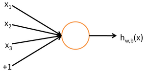

## Note for cs294A-note

(A.K.A Sparse Autoencoder)

iSea @ Jan. 12th, 2015

---

#### Content

1. 神经网络（Neural Network）
2. 反向传导算法（Backpropagation Algorithm）
3. 梯度检验与高级优化（Gradient checking and advanced optimization）
4. 自编码算法稀疏性（Autoencoder and sparsity）

---

### 1 神经网络

一个神经元的结构：

其中的+1表示常数修正项，同Logistic Regression里面的$x_0$。可以发现，如果选择**激活函数**$f(\cdot)$为sigmoid函数$f(z)=1/1+exp(-z)$，那么一层的神经网络结构就是一个LR模型。

一个多层的神经网络：

第一层是**输入层（Input Layer）**，最后一层是**输出层（Output Layer）**，其他的层都是**隐藏层（Hidden Layer）**。

将参数记做$W_{ij}^{(l)}$，输出记做$a^{(l)}_i$，权重和记做$z^{(l)}_i$，有

$$\begin{aligned}
z^{(l+1)}&=W^{(l)}a^{(l)}+b^{(l)}\\
a^{(l+1)}&=f(z^{(l+1)})
\end{aligned}$$

神经网络可以有多个输出单元。

### 2 反向传导算法

类似于线性回归，定义神经网络的代价函数为方差代价函数：

$$\begin{aligned}
J(W,b)=[\frac{1}{m}\sum^m_{i=1}(\frac{1}{2}||h_{W,b}(x^{(i)})-y^{(i)}||^2)]+\frac{1}{\lambda}\sum_{l=1}^{n_l-1}\sum_{i=1}^{s_l}\sum_{j=1}^{s_{l+1}}(W_{ji}^{(l)})^2
\end{aligned}$$

最后的项即使用MAP的regulation修正。

虽然这个函数是非凸的，直接使用梯度下降法来训练神经网络很容易陷入局部最优解，但实际上表现的很不错。**反向传导算法**是用来计算每层的偏导值：

1. 使用前面的两个式子做一次前向传递，算出所有层的激活值（activation）
2. 对输出层的每个输出单元，设
$$\begin{aligned}
\delta_i^{(n_l)}&=\frac{\partial}{\partial z_i^{(n_l)}}\frac{1}{2}||y-h_{W,b}(x)||^2\\
&=-(y_i- a_i^{(n_l)})\cdot f'(z_i^{(n_l)})
\end{aligned}$$
3. 对隐藏层的每个节点，设
$$\begin{aligned}
\delta_i^{(l)}=(\sum_{j=1}^{s_{l+1}}W_{ji}^{(l)}\delta_j^{(l+1)}) f'(z_i^{(n_l)})
\end{aligned}$$
4. 计算得到
$$\begin{aligned}
\frac{\partial}{\partial W_{ij}^{(l)}}J(W,b;x,y)&=a_j^{(l)}\delta_i^{(l+1)}\\
\frac{\partial}{\partial b_i^{(l)}}J(W,b;x,y)&=\delta_i^{(l+1)}
\end{aligned}$$

如果选用了sigmoid函数，这里的$f'(z_i^{(l)})=a_i^{(l)}(1-a_i^{(l)})$。

设置所有$W_{ij}^{(l)},b_i^{(l)}$为$\mathcal{N}(0,\epsilon^2)$来使对称失效，然后一次batch梯度下降的迭代过程为：

1. 设置$\triangle W_{ij}^{(l)},\triangle b_i^{(l)}$初始值为0
2. 对每个train set，使用前向传递算法计算出$\partial$并叠加到$\triangle W_{ij}^{(l)},\triangle b_i^{(l)}$
3. 更新参数：
$$\begin{aligned}
W^{(l)}&:=W^{(l)}-\alpha[(\frac{1}{m}\triangle W^{(l)})+\lambda W^{(l)}]\\
b^{(l)}&:=b^{(l)}-\alpha[\frac{1}{m}\triangle b^{(l)}]
\end{aligned}$$

### 3 梯度检验和高级优化

后向传播算法是个很难调试的方法，很多时候一些错误的实现方法也能得到正确的结果。这里介绍一种梯度检验方法来测试保证代码实现的正确性。

根据导数的定义：

$$\begin{aligned}\frac{J(\theta+EPS)-J(\theta-EPS)}{2\times EPS}\end{aligned}$$

对于每个参数，保持其他参数不变，计算得到偏导值，然后与实现得到的值比较的过程就是**梯度检验**。在后向传播中，具体实现即前向传递两次计算出参数的偏导值，然后与$(\frac{1}{m}\triangle W^{(l)})+\lambda W^{(l)}$或$\frac{1}{m}\triangle b^{(l)}$比较做检验。

除了梯度下降法之外，最小化$J(\theta)$还有很多其他优化方法。比如自动调整学习速率来用一个合适的步长更快的迭代至最优解，还有类似于牛顿法，近似出Hessian矩阵来“急速”的收敛到最优解。关于这些的详细讨论有些超出了范畴，可以了解的有**L-BFGS算法**和**共轭梯度**。

### 4 自编码算法与稀疏性

不同于前面的神经网络，自编码算法是一种无监督学习，只需要接受一些输入，来学习获取一些信息。一个示意图：

自编码算法试图学习$h_{W,b}(x)\approx x$，在图中即$\hat{x}\approx x$。学习的目的是什么呢？当隐藏层单元个数少于输入层单元时，通过更少的隐藏层信息，可以重构出输出层。这就是一种压缩算法，如果输出完全随机，这个压缩自然是很困难的。但是大部分时候信息有一些隐藏的关系，这个方法则可以发现一些这些隐藏关系。

这个想法是建立在隐藏层单元个数较少的前提上的，然而当这个个数较大时，仍然可以通过一些对网络的限制来发现一些有趣的结构。这里我们在隐藏层上增加一个**稀疏性**的限制，限制大部分神经元的输出值在大部分时候接近0。定义

$$\begin{aligned}\hat{\rho}_j=\frac{1}{m}\sum^m_{i=1}[a_j^{(2)}(x^{(i)})]\end{aligned}$$

将隐藏层的第$j$个神经元输出的平均值表示为它的稀疏性，通常这个数很小（比如0.05）。这时为代价函数中加入一个惩罚因子：

$$\begin{aligned}
J_{sparse}(W,b)=J(W,b)+\beta\sum_{i=1}^{s_2}(\rho\log\frac{\rho}{\hat{\rho}}+(1-\rho)\log\frac{1-\rho}{1-\hat{\rho}})
\end{aligned}$$

具体到实现步骤中，就是将计算隐藏层的$\delta$替换为：

$$\begin{aligned}
\delta_i^{(l)}=(\sum_{j=1}^{s_{l+1}}W_{ji}^{(l)}\delta_j^{(l+1)}+\beta(-\frac{\rho}{\hat{\rho_i}}+\frac{1-\rho}{1-\hat{\rho_i}})) f'(z_i^{(n_l)})
\end{aligned}$$

可以用梯度验证来验证公式是否正确。

#### Reference

[1] <http://deeplearning.stanford.edu/wiki/index.php/UFLDL_Tutorial>
[2] <http://nlp.stanford.edu/~socherr/sparseAutoencoder_2011new.pdf>